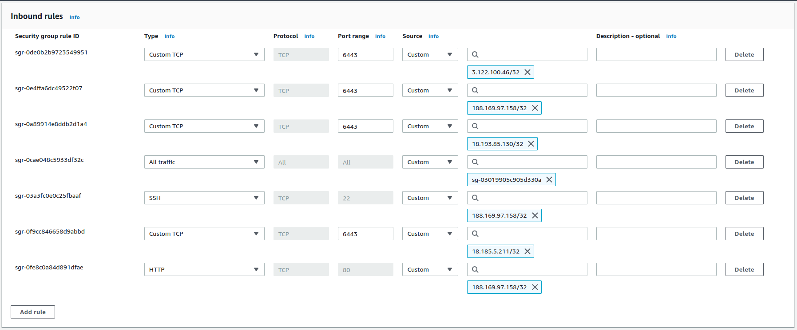

# Задание  
* Создать через Terraform 3 vps в DigitalOcean/AWS/Google Cloud (где нравится)  
* Через Ansible установить на них docker  
* Создать на нодах kubernetes кластер с помощью rke, с ингрессом  
* Подготовить docker контейнер на основе nginx, со статическим сайтом из одной HTML'ки  
* Сделать Helm-чарт, в котором будет deployment с контейнером из предыдущего шага, service для этого deployment'а и ingress для доступа снаружи  

# Решение  
## Terraform и AWS  

Через Terraform в AWS создаются ресурсы, необходимые для размещения трех ВМ в трех разных зонах доступности (VPC, subnets, security group), а также сами ВМ - будущие ноды Kubernetes кластера  

В качестве используемой ОС выбран Amazon Linux 2 - просто потому что он хороший и входит во Free Tier  

Тип инстанса "t2.medium" был выбран по причине того, что "t2.micro", входящий во Free Tier, испытывал проблемы с утилизацией CPU во время настройки kubernetes-кластера через rke  

Время создания всех ресурсов ~ 1 мин  

| Файл Terraform                                         | Содержимое                                      |
| :-----------------------------------------------------:|:------------------------------------------------|
| [provider.tf](./Terraform/provider.tf)                 | Провайдер AWS                                   |
| [config.tf](./Terraform/config.tf)                     | Настройки для сохранения Terraform state в S3   |
| [data.tf](./Terraform/data.tf)                         | Используемые данные                             |
| [variables.tf](./Terraform/variables.tf)               | Используемые переменные                         |
| [terraform.tfvars](./Terraform/terraform.tfvars)       | Задаваемые значения переменных                  |
| [main.tf](./Terraform/main.tf)                         | Описание VPC, сетей и security групп            |
| [instances.tf](./Terraform/instances.tf)               | Описание ВМ EC2                                 |
| [outputs.tf](./Terraform/outputs.tf)                   | Получение IP-адресов ВМ после terraform apply   |

## Ansible  

Установка docker на узлы будущего kubernetes-кластера реализована с помощью одного плейбука: [install_docker_knodes.yml](./Ansible/install_docker_knodes.yml)  

## Установка Kubernetes  
Список команд, выполненных на будущей мастер-ноде перед конфигурацией кластера через rke:  
```
sudo adduser rancher
sudo usermod -aG docker rancher
sudo bash
echo "rancher ALL=(ALL) NOPASSWD: ALL" >> /etc/sudoers
exit
sudo su - rancher
mkdir .ssh
chmod 700 .ssh
touch .ssh/authorized_keys
chmod 600 .ssh/authorized_keys
ssh-keygen
cat .ssh/id_rsa.pub >> .ssh/authorized_keys
```

Для выполнения этих же команд на остальных нодах, создан ещё один Ansible-плейбук: [apply_prerequisites_for_rke.yml](./Ansible/apply_prerequisites_for_rke.yml)  

Установка rke:  
```
wget https://github.com/rancher/rke/releases/download/v1.3.19/rke_linux-amd64
mv rke_linux-amd64 rke
sudo mv rke /usr/local/bin/
sudo chown rancher:rancher /usr/local/bin/rke
sudo chmod 750 /usr/local/bin/rke
```

Настройка rke на мастер-ноде:  
```
[rancher@ip-10-0-0-9 ~]$ rke config
[+] Cluster Level SSH Private Key Path [~/.ssh/id_rsa]: 
[+] Number of Hosts [1]: 
[+] SSH Address of host (1) [none]: 10.0.0.9
[+] SSH Port of host (1) [22]: 
[+] SSH Private Key Path of host (10.0.0.9) [none]: 
[-] You have entered empty SSH key path, trying fetch from SSH key parameter
[+] SSH Private Key of host (10.0.0.9) [none]: 
[-] You have entered empty SSH key, defaulting to cluster level SSH key: ~/.ssh/id_rsa
[+] SSH User of host (10.0.0.9) [ubuntu]: rancher
[+] Is host (10.0.0.9) a Control Plane host (y/n)? [y]: 
[+] Is host (10.0.0.9) a Worker host (y/n)? [n]: y
[+] Is host (10.0.0.9) an etcd host (y/n)? [n]: y
[+] Override Hostname of host (10.0.0.9) [none]: 
[+] Internal IP of host (10.0.0.9) [none]: 10.0.0.9
[+] Docker socket path on host (10.0.0.9) [/var/run/docker.sock]: 
[+] Network Plugin Type (flannel, calico, weave, canal, aci) [canal]: 
[+] Authentication Strategy [x509]: 
[+] Authorization Mode (rbac, none) [rbac]: 
[+] Kubernetes Docker image [rancher/hyperkube:v1.24.10-rancher4]: 
[+] Cluster domain [cluster.local]: 
[+] Service Cluster IP Range [10.43.0.0/16]: 
[+] Enable PodSecurityPolicy [n]: 
[+] Cluster Network CIDR [10.42.0.0/16]: 
[+] Cluster DNS Service IP [10.43.0.10]: 
[+] Add addon manifest URLs or YAML files [no]: 
[rancher@ip-10-0-0-9 ~]$ ls -la cluster.yml 
-rw-r----- 1 rancher rancher 6036 Mar 20 06:00 cluster.yml
```

Установка kubectl на мастер-ноду:  
```
curl -O https://s3.us-west-2.amazonaws.com/amazon-eks/1.25.6/2023-01-30/bin/linux/amd64/kubectl
chmod +x ./kubectl
mkdir -p $HOME/bin && cp ./kubectl $HOME/bin/kubectl && export PATH=$PATH:$HOME/bin
echo 'export PATH=$PATH:$HOME/bin' >> ~/.bashrc
kubectl version --short --client
```

Подключение kubectl к созданному кластеру:  
```
[rancher@ip-10-0-0-9 ~]$ export KUBECONFIG=kube_config_cluster.yml 
[rancher@ip-10-0-0-9 ~]$ kubectl get namespace
NAME              STATUS   AGE
default           Active   6m51s
ingress-nginx     Active   5m30s
kube-node-lease   Active   6m52s
kube-public       Active   6m52s
kube-system       Active   6m52s
```

Следующим шагом необходимо модифицировать security group для разрешения взаимодействия ВМ по порту 6443 через публичные IP:  
  

И изменить [конфигурацию кластера](./rke/cluster.yml), добавив информацию о других нодах:  
```
nodes:
- address: 18.193.85.130
  port: "22"
  internal_address: 10.0.0.9
  role:
  - controlplane
  - worker
  - etcd
  hostname_override: "knode-1"
  user: rancher
  docker_socket: /var/run/docker.sock
  ssh_key: ""
  ssh_key_path: ~/.ssh/id_rsa
  ssh_cert: ""
  ssh_cert_path: ""
  labels: {}
  taints: []
- address: 18.185.5.211
  port: "22"
  internal_address: 10.0.0.20
  role:
  - controlplane
  - worker
  - etcd
  hostname_override: "knode-2"
  user: rancher
  docker_socket: /var/run/docker.sock
  ssh_key: ""
  ssh_key_path: ~/.ssh/id_rsa
  ssh_cert: ""
  ssh_cert_path: ""
  labels: {}
  taints: []
- address: 3.122.100.46
  port: "22"
  internal_address: 10.0.0.45
  role:
  - controlplane
  - worker
  - etcd
  hostname_override: "knode-3"
  user: rancher
  docker_socket: /var/run/docker.sock
  ssh_key: ""
  ssh_key_path: ~/.ssh/id_rsa
  ssh_cert: ""
  ssh_cert_path: ""
  labels: {}
  taints: []
```

Все ноды в кластере:  
```
[rancher@ip-10-0-0-9 ~]$ export KUBECONFIG=kube_config_cluster.yml 
[rancher@ip-10-0-0-9 ~]$ kubectl get nodes
NAME      STATUS   ROLES                      AGE   VERSION
knode-1   Ready    controlplane,etcd,worker   11m   v1.24.10
knode-2   Ready    controlplane,etcd,worker   11m   v1.24.10
knode-3   Ready    controlplane,etcd,worker   11m   v1.24.10
```

Для доступа к кластеру с рабочей станции используется конфиг [kube_config_cluster.yml](./rke/kube_config_cluster.yml)

Кластер доступен:  
```
stepan@victus-laptop:~/work/fxtask/rke$ kubectl get nodes
NAME      STATUS   ROLES                      AGE   VERSION
knode-1   Ready    controlplane,etcd,worker   68m   v1.24.10
knode-2   Ready    controlplane,etcd,worker   68m   v1.24.10
knode-3   Ready    controlplane,etcd,worker   68m   v1.24.10
```
